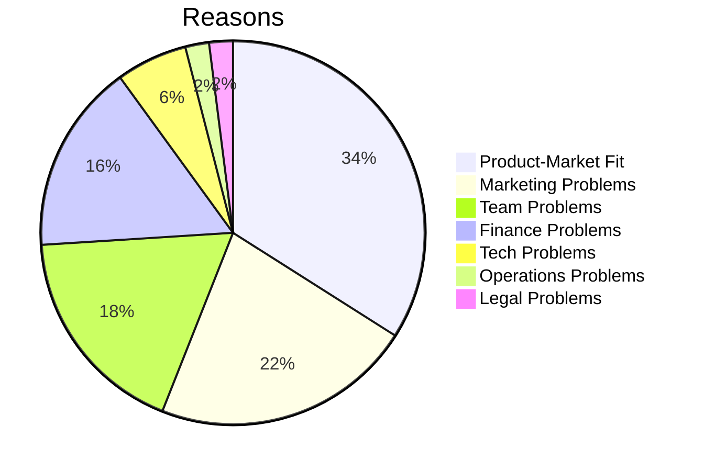

---
mermaid:
  themeVariables:
    lineColor: '#fff'
---

# Title

---

### Outline

* Why startups fail?
* Why a startup?
* Exploration vs Stabilization

Note:
Telling what I didn't read anywhere

---

### About Me

---

### Why do startups fail?

https://www.failory.com/blog/startup-failure-rate#6-reasons-why-startups-fail

---

### Reasons to start a startup

* money
* self actualization
* see your idea get big
* you will fail

---

### Exploration vs Stabilization

* Top prio: reduce uncertainty
* Build stuff, throw it at the user, learn
* But: only bastel creates its own risk. Worst case: complete stand still

----

### Be clear

* Either prototype or build platform
* Prototype: take all the shortcuts you can to achieve your learning
* Platform: Do it right the first time. There is no later.

----

### About pace

* Find the right pace

----

### Throwawayability

Prototypes should be throwawayable with no cost
Throwing away platform modules should be easy

---

### Bag of Lessons Learned

* Trust your team
* You need senior people
* social skills
* focus is crucial
* burnout and stress

### Resources

* Lean startup
* Reinventing organizations
* Extreme Programming
* The unofficial project manager
* GTD
* Paul Graham
