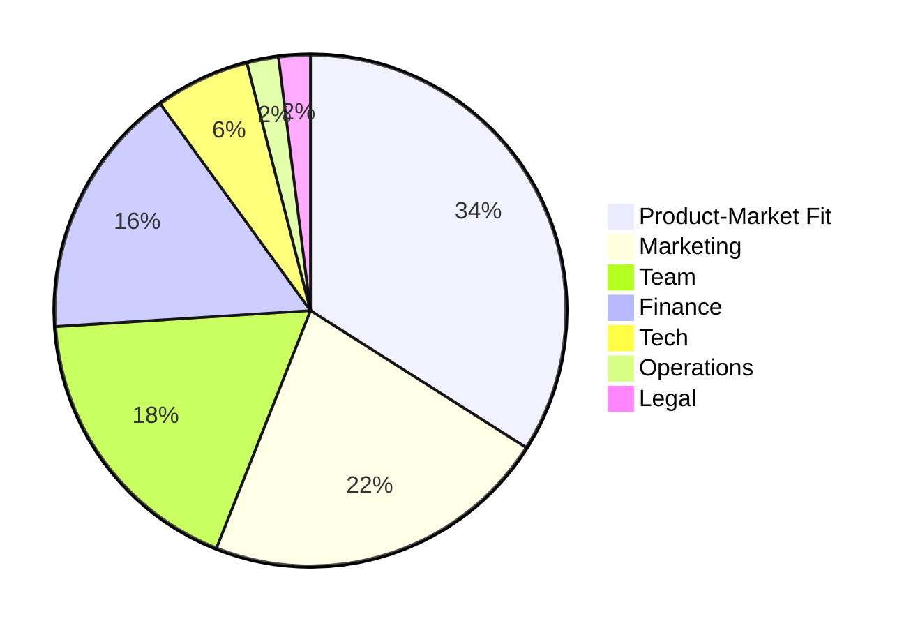

---
mermaid:
  themeVariables:
---

### ECE Summer '24
# Exploration
vs
# Stabilization
### in startups

<small>Jonas Schlagenhauf</small>

---

### Outline

* Motivations to found
* Why startups fail
* **Exploration vs Stabilization**
* Bits & Pieces

Note:
Telling what I didn't read anywhere

---

### About Me

* B.Sc & M.Sc Embedded System Engineering 
  <small>`2010-2016`</small>
* Kiteswarms - Founding Member, CTO 
  <small> `2017-2021`, 💰 Business Angel, 👤22 </small>
* Goodmotion - Consultant 
  <small>`2021`, 💰 Public Funds, 👤4 </small>
* Infrafon - CEO 
  <small>`2022`, 💰 Business Angel, 👤4</small>
* B.Braun New Ventures - Robotics Engineer 
  <small>`2023-now`, 💰 Corporate Startup, 👤55</small>

---

### Reasons to start a startup

* See your idea get big
* Self actualization
* Money (9/10 startups fail, 1/100 unicorn)

---

#### Why do startups fail?

<small><small>
https://www.failory.com/blog/startup-failure-rate#6-reasons-why-startups-fail
</small></small>

---

### Exploration vs Stabilization

* Startups are fragile -> reduce risk
* Risk <=> uncertainty
* So: Build stuff, throw it at the user, learn, reduce uncertainty
* But: Only bastel creates its own risk, worst case: complete stand still
* Technological debt

----

### Plot: pace

----

### Be clear - prototype or platform?

* Either prototype or build platform
* Prototype: Take all the shortcuts you can to achieve your learning
* Platform: Do it proper the first time. It only gets worse.
* Be rigorous

----

### About pace

* Find the right pace
* Be sensible to inefficiencies
* Too rigid -> loosen structures
* Too chaotic -> find the most central element, nail it down

----

### Radical minimalism
* Single sources of truth
* Tools: integration is key
* Keep it simple as long as possible
* Plain text is king
* Ulysses pact: tie yourself to the mast

----

### Throwawayability

Prototypes should be throwawayable with no cost
Throwing away platform modules should be easy
Also applies to infrastructure

---

### Random advice

* Trust your team
* Your idea is not as valuable as you think
* You will need senior people
* Work on your social skills
* Implement a personal task system (e.g. GTD)
* Focus is crucial
* Burnout is real

---

### Further reading

* Lean startup
* Reinventing organizations
* Extreme Programming
* The unofficial project manager
* GTD
* Paul Graham

---

### References

* link1
* link2
