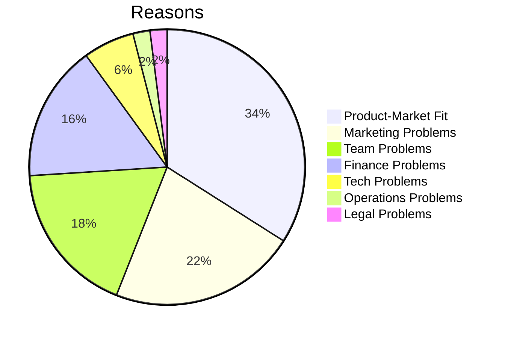

---
mermaid:
  themeVariables:
    lineColor: '#fff'
---

# Exploration vs Stabilization

ECE 2024
Jonas Schlagenhauf

---

### Outline

* Why startups fail?
* Why a startup?
* Exploration vs Stabilization

Note:
Telling what I didn't read anywhere

---

### About Me

* 2010-2017: B.Sc & M.Sc Embedded Systems Engineering
* 2017-2021: Kiteswarms GmbH - Founding Member - 20P
* 2022: Infrafon GmbH - CEO - 4P
* 2023-now: B.Braun New Ventures GmbH - Robotics Software Architect - 55P

---

### Reasons to start a startup

* See your idea get big
* Self actualization
* Money (9/10 startups fail, 1/100 unicorn)

---

### Why do startups fail?

https://www.failory.com/blog/startup-failure-rate#6-reasons-why-startups-fail

---

### Exploration vs Stabilization

* Startups are fragile -> reduce risk
* Risk <=> uncertainty
* Build stuff, throw it at the user, learn, reduce uncertainty
* But: Only bastel creates its own risk, worst case: complete stand still
* Technological debt

----

### Plot: pace

----

### Be clear - prototype or platform?

* Either prototype or build platform
* Prototype: Take all the shortcuts you can to achieve your learning
* Platform: Do it proper the first time. It only gets worse.
* Be rigorous

----

### About pace

* Find the right pace
* Be sensible to inefficiencies
* Too rigid -> loosen structures
* Too chaotic -> find the most central element, nail it down

----

### Radical minimalism
* Single sources of truth
* Tools: integration is key
* Keep it simple as long as possible
* Plain text is king
* Ulysses pact: tie yourself to the mast

----

### Throwawayability

Prototypes should be throwawayable with no cost
Throwing away platform modules should be easy
Also applies to infrastructure

---

### Random advice

* Trust your team
* You will need senior people
* Work on your social skills
* Implement a personal task system (e.g. GTD)
* Focus is crucial
* Burnout is real

---

### Further reading

* Lean startup
* Reinventing organizations
* Extreme Programming
* The unofficial project manager
* GTD
* Paul Graham

---

### References

* link1
* link2
