---
mermaid:
  themeVariables:
---
<!-- copy to backup stick -->
<!-- upload to github -->
<!-- generate pdf -->

<!-- .slide: data-background="./media/title_bg.jpg" -->

# Exploration
vs
# Stabilization
### in startups

<!-- background image -->

<small>Jonas Schlagenhauf - 2024-05-13</small> 
<small>[github.com/schlagenhauf/ece_talk_2024](https://github.com/schlagenhauf/ece_talk_2024)

---

### Outline

> "Stuff that no one told me"

* 🚀 Motivations to found a startup
* 💀 Why startups fail
* 💡 **Exploration vs Stabilization**
* 🗃 Random advice

Note: Talk is about inner workings of organization, long-term
explain exploration and stabilization

---

### About Me

* B.Sc & M.Sc Embedded System Engineering 
  <small>`2010-2016`</small>
* Kiteswarms - Founding Member, CTO 
  <small> `2017-2021`, 💰 Business Angel, 👤22 </small>
* Goodmotion - "Consultant" 
  <small>`2021`, 💰 Funding Programs & Competitions, 👤4 </small>
* Infrafon - CEO 
  <small>`2022`, 💰 Business Angel, 👤4</small>
* B.Braun New Ventures - Robotics Engineer 
  <small>`2023-now`, 💰 Corporate Startup, 👤55</small>

----

### Reasons to found a startup

* Avoid entering the work force after graduation
* Money (9/10 startups fail, 1/100 unicorn)
* See your idea get big
* **Self actualization**

Note: self-actualization is a powerfull driver
if money or no real drive, my advice is wrong
if money is your motivation, then you can do a lot more bullshit

----

#### Why do startups fail?

```mermaid
pie title
  "Product-Market Fit ❗" : 34
  "Marketing" : 22
  "Team ❗" : 18
  "Finance" : 16
  "Tech ❗" : 6
  "Operations" : 2
  "Legal" : 2
```

<small><small>
https://www.failory.com/blog/startup-failure-rate#6-reasons-why-startups-fail
</small></small>

Note: numbers are not reliable, more of a hint
PMF, team and tech are most impacted by my topic
<!-- pre-render image -->

---

### Exploration vs Stabilization

* Startups are fragile -> reduce risk
* Risk = uncertainty
* So: Build stuff, throw it at the user, learn, reduce uncertainty
* But: Only prototyping creates its own risk: Technological debt
* Worst case: complete stand-still

Note: Engineers are susceptible to overengineering

<!-- explain again terms -->
<!-- improve formatting -->

----

### Plot: line to completion

Note: mention simplification, environment may change, pivot

<!-- create plot -->

----

### Adjust your pace often

* Be sensible to inefficiencies
* Too rigid -> loosen structures
* Too chaotic -> find the most central element, nail it down
* Don't overshoot

<!-- improve formatting -->
<!-- small plot in corner? -->

----

### Prototype or Product?

* Get clear on expectations!
* Either you prototype or you build components of your product
    → Prototype: Take all the shortcuts you can to achieve your learning
    → Product: Do it proper the first time. It only gets worse.
* Don't let your prototype become your product
* Be rigorous

<!-- improve formatting -->

----

### Radical minimalism
* Single sources of truth
* Tools: integration is key
* Keep it simple as long as possible (KISS & YAGNI)
* Plain text is king
* Ulysses pact: tie yourself to the mast

<!-- improve formatting -->

----

### Throwawayability

* Prototypes should be discardable with no cost
* Throwing away product components should be easy
* Also (and especially) applies to infrastructure

Note: generally good design advice. forces clean interfaces, thinking ahead

---

### Unsorted advice

* Use git
* Trust your team
* Your idea is not as valuable as you think
* You will need senior people
* Work on your social skills
* Use a personal task management system (e.g. GTD)
* Focus is crucial
* Burnout is real

<!-- add icons -->

----

### Further reading

* Lean startup
* Reinventing organizations
* Extreme Programming
* The unofficial project manager
* GTD
* Paul Graham's Essays

<!-- add links-->

---

### Happy founding

---

### More?

---

### About trust
